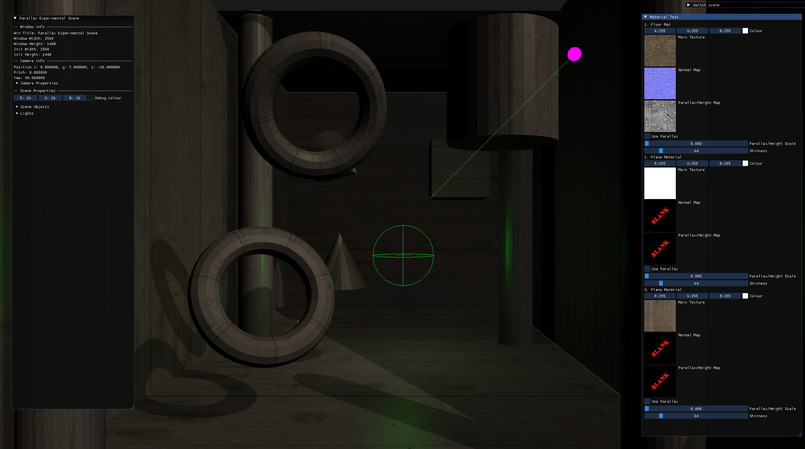
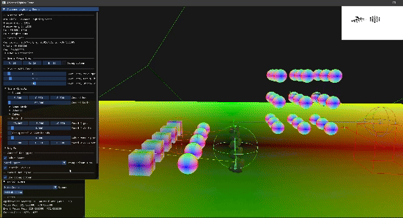

# Conqster Realtime Rendering Technology (CRRT)

CRRT is personal learning project focused on real-time 3D rendering using OpenGL. Designed to explore, implement various rendering techniques and features. 

|<a href="https://www.youtube.com/watch?v=9skO5a-XUGg">|
|:-|
|
 *A Youtube video of current Milestone with light rendering simulation.* 
|

## Goals
The primary aim of this project is to deepen my understanding of: 
-  3D Rendering techniques.
- Advance my C++ knowledge.
- Algorithms and data strutures relevant to game technologies (rendering).
- Memory management and optimization.

## Current Features
### Rendering Techniques
- Environment Mapping (Skybox)
- Scene Rendering Entities Sorting (Spatial Ordering for Transparency)
- Debug Gizmos Primitive
- Light Source (Directional, Point & Spot)
- Omnidirectional Shadow mapping for Point Lights
- Directional Light Shadow mapping
- Multisample Anti-alising (MSAA)
- Object Instancing
- Screen Space Post Processing (Grayscale, Blurring, Edge detection)
- Scene property debugging (Model-World-Space Normals, Model Space Normal debugging)
- Mesh Primitive Construction
- Naive Gamma Correction

### Utilities
- Multiscene management
- AABB Construction 
- Dyanmic AABB - Parent-children generation (~600ums for 500 hierarchy level).
- Model Loading via Assimp
- Image Loading via stb_image
- Editing UI via ImGui

## Quick Tech Samples
#### Omnidirectional Shadow (Point Lights)
||
|:-|
|
 *Omnidirectional Shadow, Point Light Shadows.* 
|

#### Light highlight on Normal mapped models
||
|:-|
|
 *Light highlight on Normal mapped model.* 
|

#### Blending (Transparency)
||
|:-|
|
 *Scene Entities Order by view distance (Transparency).* 
|

#### Directional Shadow (Directional Light)
||
|:-|
|
 *Directional Shadow, Directional Light Shadows.* 
|

#### Scene Renderer (Parent-children relation)
||
|:-|
|
 *Model's rendered with material data instance, Material Based Modeling & Parent - children relation.* 
|

#### Bounding Volume - AABB (Parent-children relation, Rendering optimisation)
||
|:-|
|
 *Only root (parent is tracked) Bounding Volume to determine is any child is visible during sorting. Construction of individual parent (root node) AABB takes ~(0.0001ms - 0.0006ms).* 
|

#### Skybox, Framebuffer
||
|:-|
|
 *Skybox, Framebuffer (renderpass), Depth test.* 
|

#### MSAA (Post Process)
||
|:-|
|
 *Multisample Anti-alising 1x-8x, Post Processing.* 
|

#### Scene Model Material  (Material Based Modeling)
||
|:-|
|
 *Model's rendered with material data instance, Material Based Modeling.* 
|

### Debugging 
#### Scene Objects Debugging
||
|:-|
|
 *Debugging, Normals (Model Space, World Space).* 
|

#### Geometry Planes
||
|:-|
|
 *Experimenting with Planes for frustrum culling.* 
|

## Documentation 
- [Quick Start.](Docs/QuickStart.md)
- [Development Issues.](Docs/DevelopmentIssues.md).

For more detailed information, please refer to the [Detailed Documentation.](Docs/Documentation.md)

## Dependencies
Current libaries in use: GLM, GLEW, GLFW, stb-image, Assimp.

## Learning Resources
- [learnopengl.com.](https://learnopengl.com/Getting-started)
- [The Cherno C++ videos.](https://www.youtube.com/playlist?list=PLlrATfBNZ98dudnM48yfGUldqGD0S4FFb)
- OpenGl Programming Guide 9th Edition (Red Book).
- Mathematics for 3D Game Programming and Computer Graphics - Eric Lengyel.
- Foundations of Game Engine Development (Volume 2 - Rendering) Eric Lengyel.
- [Forward and Deferred Rendering - Cambridge Computer Science Talks.](https://youtu.be/n5OiqJP2f7w?si=QQGg5Mj2bPoBzMiu)
- Core Techniques and Algorithms in Game Programming.
