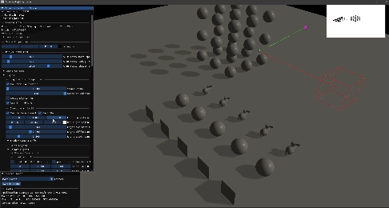

# OpenGL Rendering ~ Part of Game Tech Learning 

Welcome to my ongoing experimental learning project showcasing rendering techniques using OpenGL. Initially created for my 3D physics learning journey, I found Rendering quite fascinating. 

## Quick Start
Visual Studio 2022 was used for the development, with an x86/Debug and Windows build.

### 1. Downloading the repository

Start by downloading a Zip from the "<> Code" option.

### 2. Building the Project

A build script is not included. You can build the project directly in Visual Studio Community Edition (Press F5): 

- Build Configuration: Choose either Release or Debug.
- Supported Platform: x86.
### 3. Using Scene Manager
The project uses a `SceneManager` to handle multiple scene, each abstracted into separate classes. 

#### Registering Scenes
Scenes are registed with the `SceneManager` using a template class and a uniques string key for later retrieval.
In `Game.cpp` (within the Init function):
```
//Initialise scene manager
m_SceneManger = new SceneManager();

//Register scenes with a unique key
m_SceneManger->RegisterNewScene<MainScene>("Main Scene");
m_SceneManager->RegisterNewScene<Texture_FrameBufferScene>("Haha Frame buffer");
```
#### Loading and Storing Scenes:
To load a registered scene, use `LoadScene(const std::string& name_key, Window* window)`. This method returns `nullptr` if the scene associated with `name_key` doesn't exist:
 ```
m_CurrentScene = m_SceneManager->LoadScene("Haha Frame buffer", m_Window);
```
#### Dynamically Unloading and Loading Scenes:
To unload the current scene and load another:
 ```
m_CurrentScene->OnDestroy();
m_CurrentScene = nullptr;
m_CurrentScene = m_SceneManager->LoadScene(m_SceneManager->ScenesByNamePtr()[1], m_Window);
 ```
You can also access scenes by index: `ScenesByNamePrt()` returns an array of scene names, which can be used to load scenes dynamically by their index.
### 4. Scene
The Base `Scene` class is a wrapper around OpenGL functions and window creation, designed to facilitate learning by allowing you to experiment with new rendering techniques without overwriting previous leaned methods.

|<a href="https://www.youtube.com/watch?v=9skO5a-XUGg">|
|:-|
|<p align = "center"> *A Youtube video of current Milestone with light rendering simulation.* </p>|


## Goals
### Primary Goals
The primary aim of this project is to deepen my understanding of: 
-  3D Rendering techniques.
- Advance C++ programming techniques.
- Algorithms and data strutures relevant to game technologies.
- Memory management and optimization.
- Create a base Renderer for debugging my physics simulation in game development (through transfering 2D knowlegde to 3D).
  
### Secondary Goals
Includes:
- Program a solid basic 3D Renderer (current project) with Configuration type as dynamic linked libary (.dll).
- Return/continue with physics simulation (different project) after basis renderer (.dll) foundation is complete for linking.
- Advance Rendering simulation techniques with focus on lighting physics.
- Optimization techniques for rendering (Memory management). 
  

## Current Features
### OpenGL Rendering
- Environment Mapping (Skybox)
- Mesh Primitive Construction
- Light Source (Directional, Point & Spot)
- Omnidirectional Shadow mapping for Point Lights
- Directional Light Shadow mapping
- Multisample Anti-alising (MSAA)
- Object Instancing
- Post Processing (Grayscale, Blurring, Edge detection)
- Scene property debugging (Model-World-Space Normals, Model Space Normal debugging)
- Naive Gamma Correction

### Engine
- Debug Gizmos Primitive
- Multiscene management
- Model Loading via Assimp
- Image Loading via std_image
- Editing UI via ImGui
- Model loading via Assimp


## Development Issues
Issues encounted during development:
- [Triangle winding](ReadMe_Docs/DevelopmentIssues.md#triangle-winding)
- [Mesh Normals](ReadMe_Docs/DevelopmentIssues.md#mesh-normals)
- [Cube Mesh Texturing](ReadMe_Docs/DevelopmentIssues.md#cube-mesh-texturing)
- 
For more detailed information, please refer to the [Development Issue](ReadMe_Docs/DevelopmentIssues.md)

## Some Screenshots
#### Omnidirectional Shadow (Point Light)
||
|:-|
|<p align = "center"> *Omnidirectional Shadow, Point Light Shadows.* </p>|

#### Directional Shadow (Directional Light)
||
|:-|
|<p align = "center"> *Directional Shadow, Directional Light Shadows.* </p>|

#### Skybox, Framebuffer
||
|:-|
|<p align = "center"> *Skybox, Framebuffer (renderpass), Depth test.* </p>|

#### MSAA (Framebuffer Image Post Processing)
||
|:-|
|<p align = "center"> *Multisample Anti-alising 1x-8x, Post Processing.* </p>|

### Debugging 
#### Scene Objects Debugging
||
|:-|
|<p align = "center"> *Debugging, Normals (Model Space, World Space).* </p>|

#### Model Normals (Geometry Shaders)
||
|:-|
|<p align = "center"> *Debugging, Model Normals (Geometry Shaders).* </p>|

## External Libraries
Current libaries in use: GLM, GLEW, GLFW, stb-image, Assimp.

  
## Documentation 
For more detailed information, please refer to the [Detailed Documentation](ReadMe_Docs/Documentation.md)

## Learning Resources
- [learnopengl.com.](https://learnopengl.com/Getting-started)
- [The Cherno C++ videos.](https://www.youtube.com/playlist?list=PLlrATfBNZ98dudnM48yfGUldqGD0S4FFb)
- OpenGl Programming Guide 9th Edition (Red Book).
- Mathematics for 3D Game Programming and Computer Graphics - Eric Lengyel.
- Foundations of Game Engine Development (Volume 2 - Rendering) Eric Lengyel
- [Forward and Deferred Rendering - Cambridge Computer Science Talks.](https://youtu.be/n5OiqJP2f7w?si=QQGg5Mj2bPoBzMiu)
- Core Techniques and Algorithms in Game Programming.
